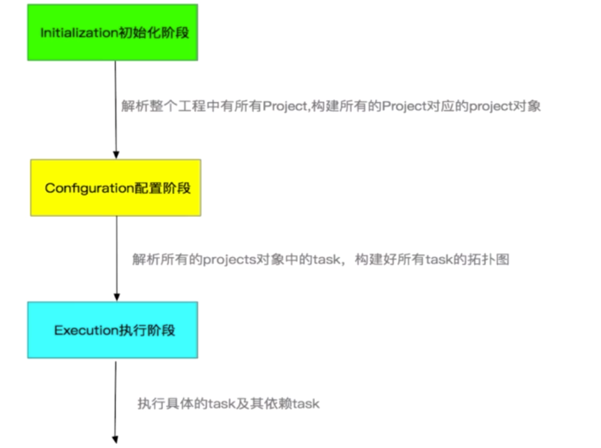

## Gradle是什么？
Gradle是一个编程框架

## Gradle的优势
- 兼容性更好，相对于Ant、Maven等构建工具
- 颗粒度小，灵活性高。Gradle把任务拆分成一个一个的Task，可以进行灵活配置

## Gradle执行流程

整个过程：



## Gradle生命周期解析

如何监听生命周期，只要有以下几个：
build.gradle
```groovy
//配置阶段开始前的监听
this.beforeEvaluate{}
//配置监听完成以后的回调
this.afterEvaluate{}
//gradle执行完毕后的监听
this.gradle.buildFinished{}
```
配置完成后就会生成有向无环图。

## gradle project讲解

只要有build.gradle，它就是一个Project。
Project是以树的形式去管理Project，但是总共就两层。

### Project的核心Api


```groovy
/**project 相关api**/

//1、
this.getAllProjects().eachWithIndex{  Project project.int index
  if(index == 0){
   //根project
  }else{
   //子project
  }
}

//2、获取子Project，同样的，父project获取调用getParent（）
this.getSubProject().eachWithIndex{  Project project.int index
      if(index == 0){
       //根project
      }else{
       //子project
      }
    }

//3、
project('app'){Project project ->
    //project就是我们找到的project
    //可以在这个地方对这个project进行任何操作
    apply plugin: 'com.android.application'
    group 'com.immoc'
    version '1.0.0-alpha'
    dependencies{}
    android{}
}

//4、对所有工程进行统一 配置
allprojects(){
  group 'com.imooc'
  version '1.0.0-alpha'
}

//5、对子工程
subprojects{ Project project ->
    apply from : '../publishToMaven.gradle'
}
```


## Gradle Plugin


